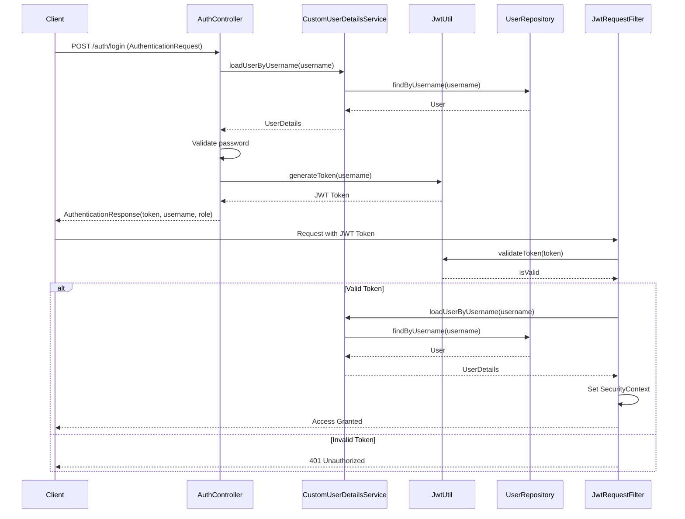

[//]: # (Install Mermaid plugin to view solution)

This sequence diagram illustrates two main flows:
1. **Authentication Flow (Login)**:
    - Client sends login credentials to `/auth/login`
    - AuthController receives the request and validates credentials
    - CustomUserDetailsService loads user details from the repository
    - JwtUtil generates a JWT token upon successful authentication
    - Client receives the token and user information

2. **Protected Endpoint Flow**:
    - Client sends a request with JWT token in header
    - JwtRequestFilter intercepts the request
    - JwtUtil validates the token
    - If valid, loads user details and sets security context
    - If invalid, returns 401 Unauthorized
