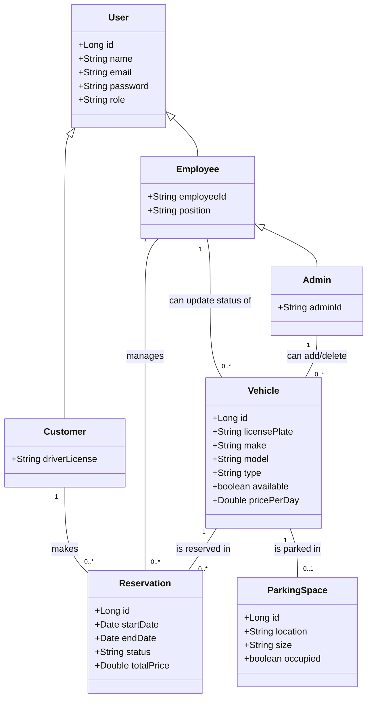

```mermaid
  classDiagram
    class User {
        +Long id
        +String name
        +String email
        +String password
        +String role
    }

    class Customer {
        +String driverLicense
    }

    class Employee {
        +String employeeId
        +String position
    }

    class Admin {
        +String adminId
    }

    class Vehicle {
        +Long id
        +String licensePlate
        +String make
        +String model
        +String type
        +boolean available
        +Double pricePerDay
    }

    class Reservation {
        +Long id
        +Date startDate
        +Date endDate
        +String status
        +Double totalPrice
    }

    class ParkingSpace {
        +Long id
        +String location
        +String size
        +boolean occupied
    }

%% Relationships
    User <|-- Customer
    User <|-- Employee
    Employee <|-- Admin
    Customer "1" -- "0..*" Reservation: makes
    Employee "1" -- "0..*" Reservation: manages
    Vehicle "1" -- "0..*" Reservation: is reserved in
    Vehicle "1" -- "0..1" ParkingSpace: is parked in
    Employee "1" -- "0..*" Vehicle: can update status of
    Admin "1" -- "0..*" Vehicle: can add/delete
```
