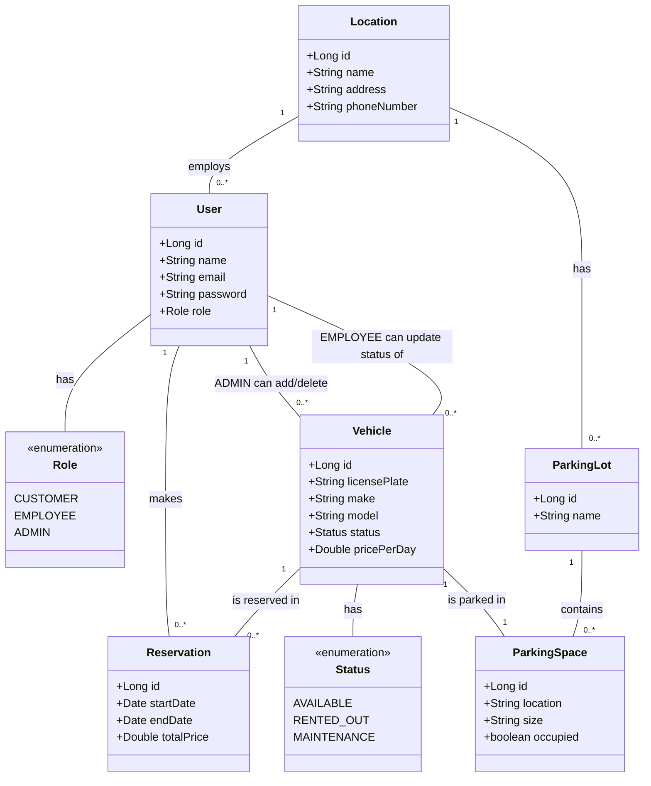

[//]: # (Install Mermaid plugin to view solution)

```mermaid
  classDiagram
    class User {
        +Long id
        +String name
        +String email
        +String password
        +Role role
    }

    class Role {
        <<enumeration>>
        CUSTOMER
        EMPLOYEE
        ADMIN
    }

    class Vehicle {
        +Long id
        +String licensePlate
        +String make
        +String model
        +Status status
        +Double pricePerDay
    }

    class Reservation {
        +Long id
        +Date startDate
        +Date endDate
        +Double totalPrice
    }

    class ParkingSpace {
        +Long id
        +String location
        +String size
        +boolean occupied
    }

    class ParkingLot {
        +Long id
        +String name
    }

    class Location {
        +Long id
        +String name
        +String address
        +String phoneNumber
    }

    class Status {
        <<enumeration>>
        AVAILABLE
        RENTED_OUT
        MAINTENANCE
    }

%% Relationships
    User "1" -- "0..*" Vehicle : EMPLOYEE can update status of
    User "1" -- "0..*" Vehicle : ADMIN can add/delete
    Vehicle "1" -- "0..*" Reservation : is reserved in
    User "1" -- "0..*" Reservation : makes
    ParkingLot "1" -- "0..*" ParkingSpace : contains
    Vehicle "1" -- "1" ParkingSpace : is parked in
    Location "1" -- "0..*" User : employs
    Location "1" -- "0..*" ParkingLot : has
    User -- Role : has
    Vehicle -- Status : has

```
